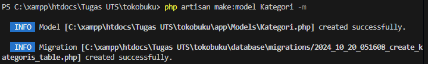
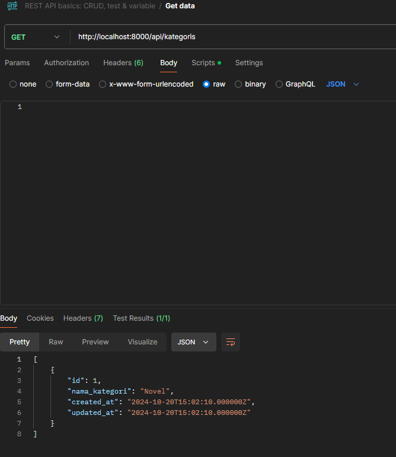

NAMA:SAMUEL RIVALDO SARAGIH
NIM:362358302156
KELAS: 2B TRPL

1. Instalasi Laravel 11:
   Pastikan sudah terinstal PHP, Composer, dan MySQL.
   Instal Laravel:
   

   

   

2. Konfigurasi Database:
   Buat database MySQL baru bernama 'tokobuku_db'.
   Sesuaikan file .env dengan informasi berikut:

   

3. Migrasi Awal:
   Jalankan perintah berikut untuk membuat tabel default:

   

4. Membuat Migration dan Model
   Buat migration dan model untuk Kategori dan Buku:

   

    Edit file migration `create_kategoris_table.php`:

   

    Edit file migration `create_bukus_table.php`
   

 5. Membuat Controller API untuk Kategori dan Buku
  Buat controller untuk Kategori dan Buku:
  

  Isi file `KategoriController.php`:
  

  Testing API dengan Postman
  Jalankan server Laravel:
  

  Testing endpoint menggunakan Postman:
  GET
  
  POST
  

POST Tambah Buku Baru

GET Buku Berdasarkan ID

PUT Update Data Buku

DELETE Hapus Buku

Tugas Mahasiswa
1.	Tambahkan Validasi:
o	Nama buku tidak boleh kosong.
o	Harga minimal Rp 1.000.

2.	Rancang Endpoint Baru:
Buatlah satu endpoint tambahan untuk sistem toko buku, misalnya, endpoint untuk mencari buku berdasarkan kategori atau judul. Tantangan: Apa pertimbangan yang harus Anda buat saat merancang endpoint ini? Pertimbangkan aspek performa, skalabilitas, dan pengalaman pengguna.

3.	Uji API Secara Publik:
o	Gunakan ngrok atau sejenisnya untuk membuka API ke internet.

Jawaban:
Ditambahkan validasi dan endpoint ununtk pencarian buku

